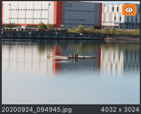
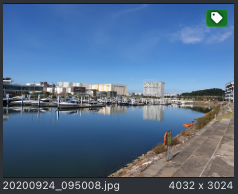

.. _annotation:

어노테이션
===================================================

이미지 어노테이션(Annotation)은 영상 이미지와 관련된, 사람이 인지 가능한 객체, 환경, 상황에 대한 표식으로 정의될 수 있으며, 라벨, 레이블, 태그 등으로도 알려져 있습니다.

이미지 어노테이션 작업은 영상 이미지 내에 어노테이션을 남김으로써 추후 인공지능 학습에 활용할 데이터를 생성하는 작업이며, 라벨링, 태깅 등으로도 불립니다.

이미지 어노테이션의 정보는 이미지의 전체 혹은 부분과 반드시 연관되어 있어야 하며, 인공지능은 해당 연관성을 학습하게 됩니다.

본 어노테이션 도구는 아래의 두 가지 형식의 어노테이션을 지원합니다.

* :ref:`다각형 어노테이션<geometryAnnotation>`: 바운딩 박스, 폴리곤, 선분 등의 다각형 정보를 이용한 어노테이션
* :ref:`세그먼트 어노테이션<segmentAnnotation>`: 세그멘테이션 기법을 통해 산출된 세그멘트를 이용한 어노테이션

다각형 어노테이션의 특징은 이미지에 다각형을 추가하여 어노테이션을 특정하기 때문에 겹쳐진 객체에 대한 별도의 표기가 가능하다는 점입니다.

세그먼트 어노테이션은 한 이미지를 여러 세그먼트로 나누어 각 세그먼트의 연관 정보를 기입하는 형식이기 때문에 겹쳐진 객체는 하나의 어노테이션으로 특정됩니다.

어노테이션 방식은 각 어노테이션 편집마다 상이합니다. 보다 자세한 사항은 각 어노테이션 설명 페이지를 참조해주세요.

어노테이션 진행 상태
^^^^^^^^^^^^^^^^^^^^
사용자는 각 어노테이션 편집기 인터페이스의 (B) 이미지 목록의 우측 상단 표식을 통해 각 이미지(어셋)의 어노테이션 진행 상태를 알 수 있습니다.

이미지(어셋)을 방문한 상태, 어노테이션은 진행되지 않음

이미지(어셋)의 어노테이션이 진행된 상태

상기 표식이 없는 이미지(어셋)은 방문되지 않은 상태이며 산출 옵션에 따라 결과물 산출 시 배제될 수 있습니다.
