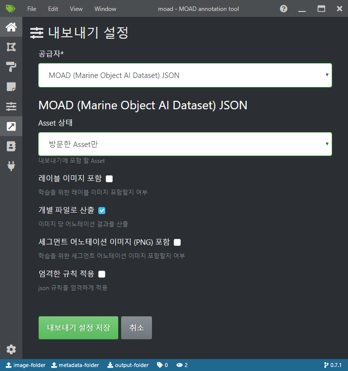

.. _export:

어노테이션 결과 산출
===================================================

본 페이지에선 어노테이션 결과를 MOAD 프로젝트에서 지정된 JSON 형식으로 산출하기 위한 방법을 서술합니다.

산출 형식 지정
---------------------

현재 모든 프로젝트는 MOAD JSON 형식을 기본 산출 형식으로 사용하고 있습니다.

'레이블 이미지 포함' 활성화 시 원본 작업 이미지도 함께 산출됩니다.

상기 설정 중 '개별 파일로 산출'이 활성화 되어 있으면 각 이미지의 다각형 및 세그먼트 어노테이션 결과가 하기의 형식을 따라 개별 파일로 저장됩니다.

MOAD의 JSON 형식은 아래의 JSON schema 형식으로 정의됩니다.

* 다각형 어노테이션: https://github.com/Digital-Maritime-Consultancy/docs.moad-at/blob/master/docs/source/_static/codes/moad_BBPG_data_schema.json
* 세그먼트 어노테이션: https://github.com/Digital-Maritime-Consultancy/docs.moad-at/blob/master/docs/source/_static/codes/moad_PS_data_schema.json

'개별 파일로 산출' 비활성화 시 모든 어노테이션 결과는 한 파일에 저장되어 산출됩니다.

'세그먼트 어노테이션 이미지(PNG) 포함' 활성화 시 세그먼트 어노테이션 결과가 PNG 파일로 산출됩니다.

