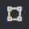
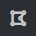
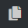
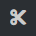
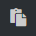
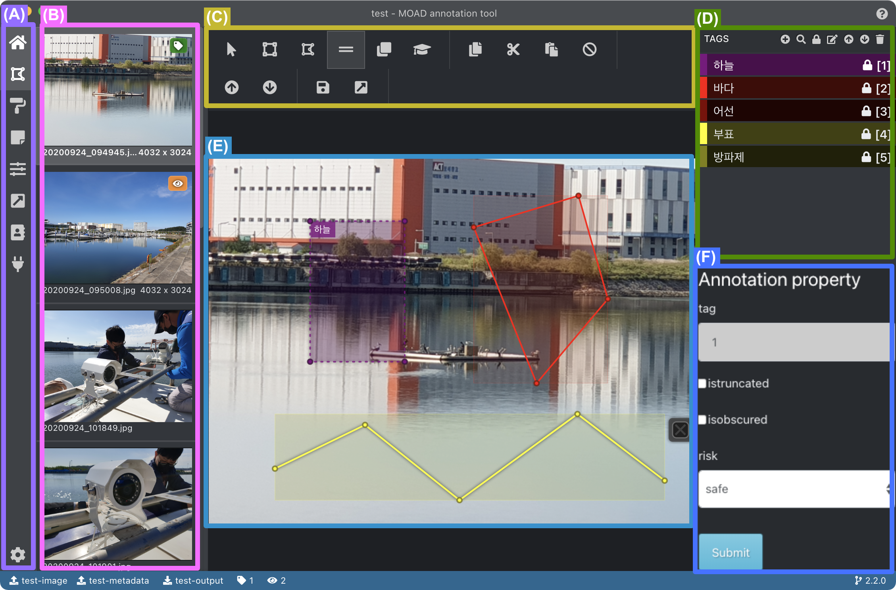

.. _geometryAnnotation:

.. |icon_select| image:: _static/images/icons/select.png  

.. |icon_polyline| image:: _static/images/icons/polyline.png  

.. |icon_remoAll| image:: _static/images/icons/remoAll.png  
.. |icon_prev| image:: _static/images/icons/prev.png  
.. |icon_next| image:: _static/images/icons/next.png  
.. |icon_saveProj| image:: _static/images/icons/saveProj.png  
.. |icon_exportAnno| image:: _static/images/icons/exportAnno.png 

다각형 어노테이션 편집
===================================================

본 페이지에서는 다각형 어노테이션 편집기를 이용한 어노테이션 방법에 대하여 서술합니다. 

다각형 어노테이션은 이미지 내 어노테이션을 수행할 영역(다각형)을 먼저 생성하고, 태그 및 속성을 후에 설정하는 방식으로 어노테이션 작업을 수행합니다.

인터페이스
------------------

아래 그림은 주 메뉴에서 다각형 어노테이션 편집을 선택했을 때 보이는 인터페이스를 나타냅니다.

    다각형 어노테이션 편집 인터페이스

상기 인터페이스의 각 화면 영역의 기능은 다음과 같습니다.

(A): 주 메뉴,
(B): 이미지 목록,
(C): 편집 도구,
(D): 어노테이션 태그 편집,
(E): 주 편집 화면,
(F): 어노테이션 속성 편집

(A)에 대한 설명은 주 메뉴 설명<mainMenu> 을 참조해주세요. 

사용자는 (B)를 통해 편집할 이미지를 선택하고 (C)와 (E)를 통해 영역을 생성한 후 (D)와 (F)를 통해 선택된 영역에 대한 어노테이션 태그 및 속성을 편집하게 됩니다.

편집 도구 설명 - 인터페이스 (C)
^^^^^^^^^^^^^^^^^^^^^^^^^^^^^^^^^^^

* |icon_select|: 선택, 영역을 선택하거나 편집할 때 사용합니다.
* |icon_rect|: 사각형 그리기, 마우스 드래그와 드롭을 이용하여 사각형 영역을 생성합니다.
* |icon_polygon|: 다각형 그리기, 마우스 클릭 및 드래그를 이용하여 점을 추가하고 마지막에 'esc' 버튼을 눌러 다각형 그리기를 종료합니다.
* |icon_polyline|: 선 그리기, 마우스 클릭 및 드래그를 이용하여 점을 추가하고 마지막에 'esc' 버튼을 눌러 선분 그리기를 종료합니다.
* |icon_copyRec|: 사각형 복사, 선택된 사각형 영역을 복사합니다.
* |icon_actLearn|: 자동 어노테이션, 학습 모델을 통해 자동으로 영역 어노테이션을 수행합니다.
* |icon_copyReg|: 영역 복사, 선택된 영역을 복사합니다.
* |icon_cutReg|: 영역 잘라내기, 선택된 영역을 잘라내기 합니다.
* |icon_pasteReg|: 영역 붙여넣기, 복사 혹은 잘라내기 된 영역을 붙여넣습니다.
* |icon_remoAll|: 모든 지역 제거, 모든 영역을 제거합니다.
* |icon_prev|: 이전 어셋, 이전 이미지 및 작업으로 이동합니다.
* |icon_next|: 다음 어셋, 다음 이미지 및 작업으로 이동합니다.
* |icon_saveProj|: 프로젝트 저장, 프로젝트를 저장합니다.
* |icon_exportAnno|: 프로젝트 내보내기, 프로젝트 산출물을 생성합니다. 자세한 내용은 :ref:`어노테이션 결과 JSON 파일 산출<export>` 참조해주세요.

영역 생성 - 인터페이스 (E)
^^^^^^^^^^^^^^^^^^^^^^^^^^^^^^^^^^
상기 편집 도구 중 |icon_rect| 또는 |icon_polygon| 또는 |icon_polyline| 를 선택하여 마우스를 이동하여 영역을 생성합니다.

영역 선택 - 인터페이스 (E)
^^^^^^^^^^^^^^^^^^^^^^^^^^^^^^^^^^
|icon_select| 아이콘을 눌러 영역을 선택합니다. 선택되지 않은 영역은 점선으로, 선택된 영역은 실선으로 표시됩니다. 다수의 영역도 선택할 수 있습니다.

영역이 선택되었을 때 인터페이스의 (D) 영역은 해당 어노테이션 태그 값을, 인터페이스의 (F) 영역은 해당 어노테이션 속성 값을 표출합니다.

영역 편집 - 인터페이스 (E)
^^^^^^^^^^^^^^^^^^^^^^^^^^^^^^^^^^
영역이 선택된 상태에서 꼭지점들을 이동시켜 영역의 모양을 편집합니다.

영역 삭제 - 인터페이스 (E)
^^^^^^^^^^^^^^^^^^^^^^^^^^^^^^^^^^
영역이 선택된 상태에서 우측에 자동 생성되는 'X' 표시를 눌러 영역을 삭제합니다.

영역의 어노테이션 태그 적용 - 인터페이스 (D)
^^^^^^^^^^^^^^^^^^^^^^^^^^^^^^^^^^^^^^^^^^^^
영역이 선택된 상태에서 인터페이스의 (D) 영역을 통해 어노테이션 태그를 적용할 수 있습니다. 하나의 영역은 하나의 태그만 적용이 가능합니다.

영역의 어노테이션 속성 적용 - 인터페이스 (F)
^^^^^^^^^^^^^^^^^^^^^^^^^^^^^^^^^^^^^^^^^^^^^^^^^^^^^^^^
영역이 선택된 상태에서 인터페이스의 (F) 영역을 통해 어노테이션 속성을 편집할 수 있습니다. 해당 영역은 영역이 선택되었을 때만 활성화됩니다. 편집 후 반드시 하단의 submit 버튼을 눌러 저장을 수행합니다.

단축키
------------------

다각형 어노테이션 편집기는 아래와 같은 단축키를 지원합니다.

