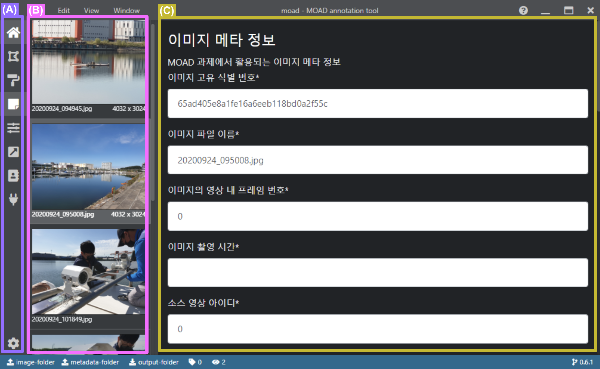

.. _imageMetadata:

이미지 메타데이터 편집
===================================================

이미지 메타데이터 편집은 메타데이터 폴더의 .json 형식의 파일을 불러와 각 이미지에 해당되는 상황 정보 등을 직접 편집할 수 있도록 해줍니다.

각 항목에 맞는 값을 입력 후 반드시 하단의 'submit' 버튼을 눌러 결과를 저장하도록 합니다.

편집 결과는 메타데이터 폴더의 json 파일에 저장됩니다.
