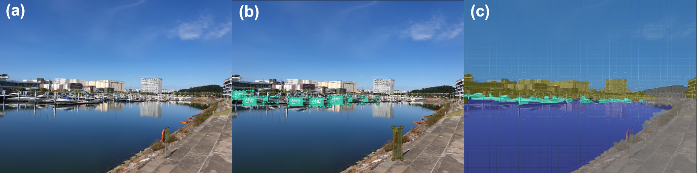
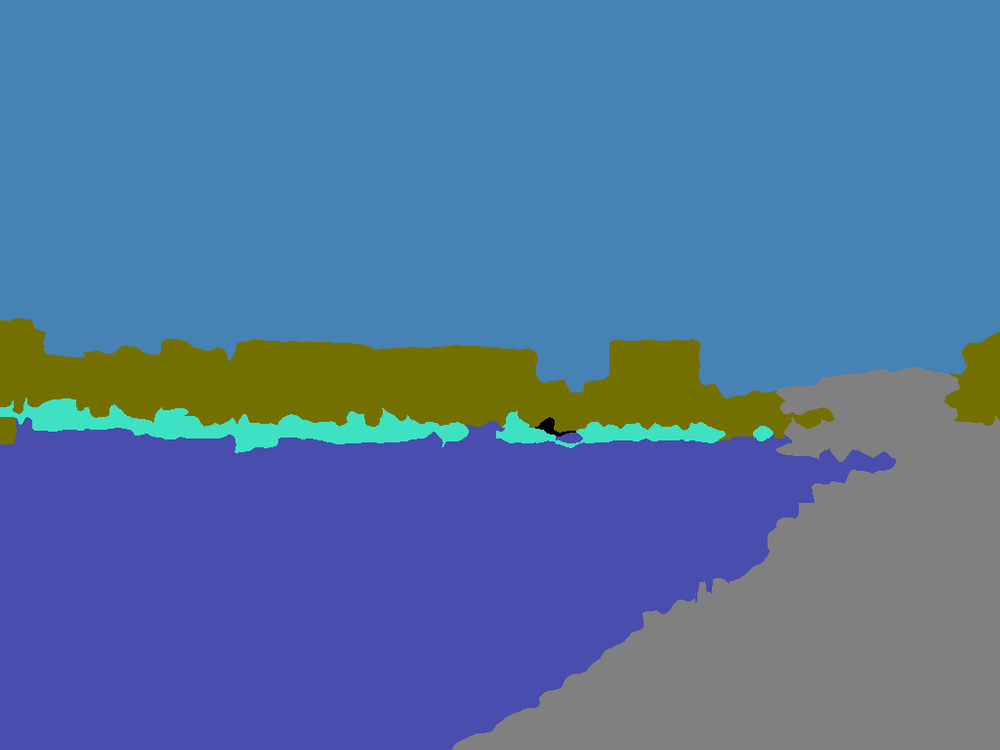

.. _overview:

도구 소개
==========

본 어노테이션 도구는 해양객체 이미지 AI 데이터 (MOAD) 프로젝트의 산출물인 인공지능 학습용 어노테이션 데이터 생성을 위해 만들어졌습니다.

어노테이션 도구의 목적은 주어진 이미지와 :ref:`세그먼트 캔버스<segmentCanvasGeneration>` 를 이용하여 아래의 두 종류의 어노테이션 결과를 산출하는 것입니다.

    어노테이션 도구 작업 결과물 예제: (a) 원본 이미지, (b) 다각형 어노테이션, (c) 세그먼트 어노테이션

* 다각형 어노테이션: 바운딩 박스, 폴리곤, 폴리라인 등의 다각형 정보를 이용한 어노테이션
* 세그먼트 어노테이션: 세그멘테이션 기법을 통해 산출된 세그멘트를 이용한 어노테이션

상기 어노테이션은 :ref:`어노테이션 결과 산출<export>` 을 통해 기계학습을 위한 어노테이션 JSON 혹은 마스크 이미지(PNG)로 산출됩니다. 

.. code-block:: json
    :caption: 다각형 어노테이션 JSON 예제

    [
        {
            "id": "WLW3SKUOx",
            "image_id": "1edfc83e60508614097561f4893f897f",
            "category_id": "선박",
            "type": "boundingbox",
            "segmentation": [
                {
                    "x": 2781.051258349237,
                    "y": 667.9828980911607
                },
                {
                    "x": 3448.8495944656497,
                    "y": 667.9828980911607
                },
                {
                    "x": 3448.8495944656497,
                    "y": 1658.9386256018345
                },
                {
                    "x": 2781.051258349237,
                    "y": 1658.9386256018345
                }
            ],
            "properties": {},
            "area": 661758.5859966569,
            "bbox": {
                "height": 990.9557275106738,
                "width": 667.7983361164122,
                "left": 2781.051258349237,
                "top": 667.9828980911607
            },
            "isobscured": 0,
            "istruncated": 0,
            "risk": "safe"
        }
    ]

.. code-block:: json
    :caption: 세그먼트 어노테이션 JSON 예제

    [
        {
            "id": "8nFvrakdxH",
            "image_id": "1edfc83e60508614097561f4893f897f",
            "category_id": "섬",
            "segmentation_method_id": 0,
            "superpixel": [
                870,
                872,
                873,
                879,
                880,
                940,
                949,
                950
            ],
            "area": 2414,
            "bbox": {
                "left": 0,
                "top": 217,
                "width": 82,
                "height": 40
            },
            "iscrowd": 0,
            "risk": "safe"
        }
    ]

    마스크 이미지 예제

어노테이션을 수행하는 방법에 대한 보다 자세한 정보는 :ref:`어노테이션<annotation>` 페이지를 확인해주세요.

본 어노테이션 도구는 부가적으로 MOAD 프로젝트에서 정의된 이미지의 메타데이터를 확인하고 편집하는 기능도 함께 제공됩니다.

어노테이션 작업 순서는 다음과 같습니다.

1. :ref:`사전 준비<prerequisite>`
2. :ref:`다각형 어노테이션 수행<geometryAnnotation>`
3. :ref:`세그먼트 어노테이션 수행<segmentAnnotation>`
4. :ref:`이미지 메타데이터 편집 및 확인<imageMetadata>`
5. :ref:`어노테이션 결과 JSON 파일 산출<export>`
6. 검수

본 어노테이션 도구는 Microsoft 사의 Visual Object Tagging Tool (VoTT)를 기반으로 만들었습니다. (프로젝트 링크: https://github.com/microsoft/VoTT)
