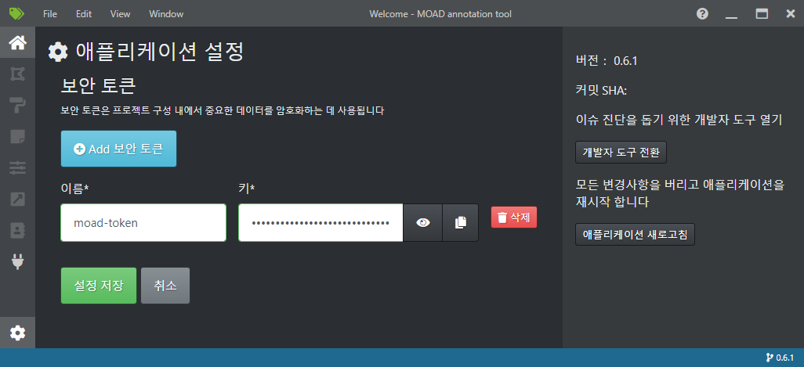
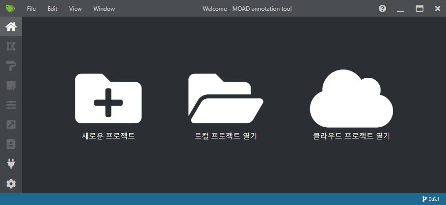

.. _projectCreation:

프로젝트 생성
===================================================

보안 토큰 관리 및 생성
----------------------
프로젝트 관리의 보안을 위해 새로운 프로젝트 생성 이전에 사용할 보안 토큰을 먼저 생성합니다. 

좌측 하단의 톱니 바퀴 모양의 아이콘을 눌러 보안 토큰 관리 화면으로 이동 후, 이름을 기입하여 보안 토큰을 생성합니다.

보안 토큰이 생성 후 '설정 저장' 버튼을 눌러 변경 사항을 저장합니다.

새로운 프로젝트 생성
---------------------

프로그램 초기 실행 시 세 가지의 메뉴가 보입니다: 새로운 프로젝트, 로컬 프로젝트 열기, 클라우드 프로젝트 열기

이 중 프로젝트 생성 버튼을 눌러 프로젝트의 상세 정보 입력 페이지로 이동합니다.

.. image:: _static/images/screenshots/projectCreatePage.PNG
    :align: center
    :alt: 프로젝트 정보 입력 화면

프로젝트 정보에 입력해야 할 정보는 다음과 같습니다.

* 프로젝트 이름: 프로젝트의 이름
* 보안 토큰: 상단의 '보안 토큰 관리 및 생성' 단계에서 생성한 토큰을 지정해야 함
* 소스 연결: 어노테이션에 사용될 이미지들이 저장된 폴더
* 메타데이터 연결: 세그먼트 캔버스 및 이미지 메타데이터가 저장된 폴더
* 대상 연결: 중간 저장물 및 산출물이 저장될 폴더
* 설명: 프로젝트 설명 기술
* 비디오 설정: 비디오 입력을 위한 설정, 본 프로젝트에서는 사용하지 않음
* 태그: 프로젝트에서 사용할 어노테이션 태그 목록, 추가나 편집 가능

태그 정보에는 아래 그림과 같이 프로젝트에서 활용할 어노테이션 태그 목록을 추가하실 수 있습니다.

.. image:: _static/images/screenshots/projectCreateTag.PNG
    :align: center
    :alt: 프로젝트 태그 목록 입력 화면

필수 항목을 모두 입력하신 후 '프로젝트 저장' 버튼을 누르면 새로운 프로젝트가 생성됩니다.