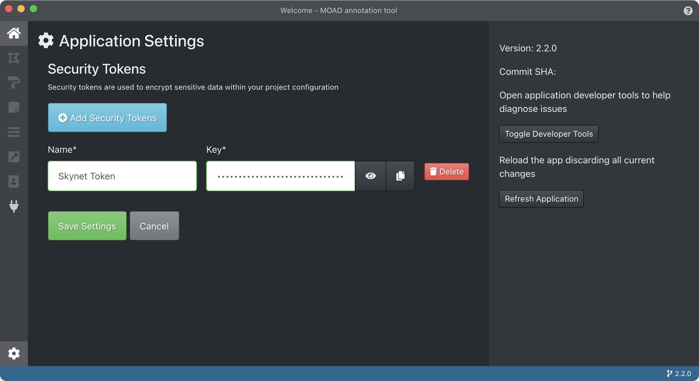
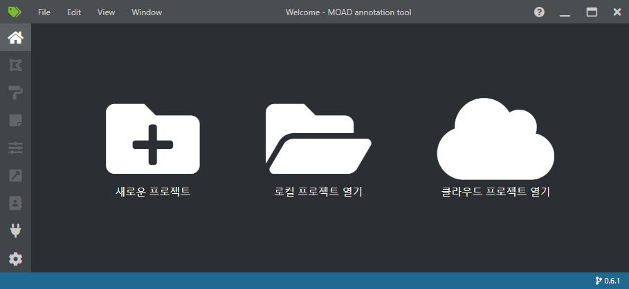

.. _projectCreation:

프로젝트 생성
===================================================

보안 토큰 관리 및 생성
----------------------
프로젝트 관리의 보안을 위해 새로운 프로젝트 생성 이전에 사용할 보안 토큰을 먼저 생성합니다. 

좌측 하단의 톱니 바퀴 모양의 아이콘을 눌러 보안 토큰 관리 화면으로 이동 후, 이름을 기입하여 보안 토큰을 생성합니다.

보안 토큰이 생성되면 설정을 저장합니다.

프로젝트 생성
-----------------

프로그램 초기 실행 시 세 가지의 메뉴가 보입니다: 프로젝트 생성, 프로젝트 열기, 클라우드 프로젝트 열기

이 중 프로젝트 생성 버튼을 눌러 프로젝트의 상세 정보 입력 페이지로 이동합니다.

프로젝트 정보에 입력해야 할 정보는 다음과 같습니다.

* Display name: 프로젝트의 이름
* Security token: 보안 토큰, 이 전에 생성한 토큰을 지정해야 함
* Source connection: 이미지가 저장된 폴더
* Metadata connection: 세그멘테이션 데이터 및 이미지 메타데이터가 저장된 폴더
* Target connection: 산출물이 저장될 폴더
* Description: 프로젝트 설명 기술
* Video settion: 비디오 설정이나 본 프로젝트에서는 설정하지 않으셔도 됩니다.
* Tags: 프로젝트에서 사용할 어노테이션 태그 목록, 추가나 편집 가능

필수 항목을 입력하신 후 저장 버튼을 누르면 새로운 프로젝트가 생성됩니다.