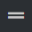
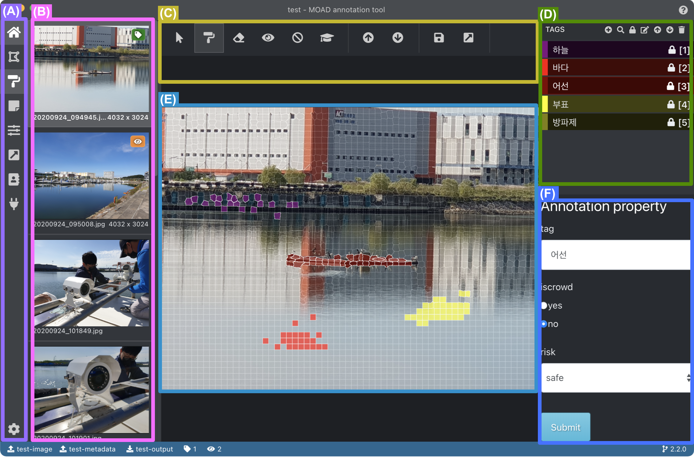
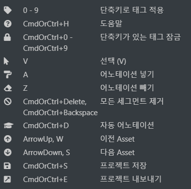

.. _segmentAnnotation:

.. |icon_annoSeg| image:: _static/images/icons/annoSeg.png  

.. |icon_remoAll| image:: _static/images/icons/remoAll.png  

.. |icon_prev| image:: _static/images/icons/prev.png  

.. |icon_saveProj| image:: _static/images/icons/saveProj.png  
.. |icon_exportAnno| image:: _static/images/icons/exportAnno.png 

세그먼트 어노테이션 편집
===================================================

본 페이지에서는 세그먼트 어노테이션 편집기를 이용한 어노테이션 방법에 대하여 서술합니다. 

세그먼트 어노테이션은 세그먼테이션을 통해 생성된 세그먼트들에 태그 및 속성을 설정하는 방식으로 어노테이션 작업을 수행합니다.

본 세그먼트 어노테이션을 수행하기 위해선 세그먼트 캔버스를 불러올 수 있어야 합니다. 보다 자세한 사항은 :ref:`사전 준비<prerequisite>` 를 참조해주세요.

인터페이스
------------------

아래 그림은 주 메뉴에서 세그먼트 어노테이션 편집을 선택했을 때 보이는 인터페이스를 나타냅니다.

    세그먼트 어노테이션 편집 인터페이스

상기 인터페이스의 각 화면 영역의 기능은 다음과 같습니다.

(A): 주 메뉴,
(B): 이미지 목록,
(C): 편집 도구,
(D): 어노테이션 태그 편집,
(E): 주 편집 화면,
(F): 어노테이션 속성 편집

(A)에 대한 설명은 주 메뉴 설명<mainMenu> 을 참조해주세요. 

사용자는 (B)를 통해 편집할 이미지를 선택하고 (C), (D), (E)를 통해 어노테이션을 생성한 후 (F)를 통해 선택된 어노테이션에 대한 속성을 편집하게 됩니다.

편집 도구 설명 - 인터페이스 (C)
^^^^^^^^^^^^^^^^^^^^^^^^^^^^^^^^^^^

* |icon_select|: 선택, 영역을 선택하거나 편집할 때 사용합니다.
* |icon_annoSeg|: 어노테이션 생성, 마우스 왼쪽 버튼 드래그를 이용하여 (D)에서 선택된 태그에 대한 어노테이션을 생성합니다.
* |icon_remoSeg|: 어노테이션 제거, 마우스 왼쪽 버튼 드래그를 이용하여 어노테이션을 제거합니다.
* |icon_remoAll|: 모든 어노테이션 제거, 모든 세그먼트의 어노테이션을 제거합니다.
* |icon_showBoundary|: 세그먼트 외곽선 보이기/숨기기
* |icon_prev|: 이전 어셋, 이전 이미지 및 작업으로 이동합니다.
* |icon_next|: 다음 어셋, 다음 이미지 및 작업으로 이동합니다.
* |icon_saveProj|: 프로젝트 저장, 프로젝트를 저장합니다.
* |icon_exportAnno|: 프로젝트 내보내기, 프로젝트 산출물을 생성합니다. 자세한 내용은 :ref:`어노테이션 결과 산출<export>` 를 참조해주세요.

어노테이션 태그 선택 - 인터페이스 (D)
^^^^^^^^^^^^^^^^^^^^^^^^^^^^^^^^^^^^^^^^^^^^
|icon_annoSeg| 가 선택된 상태에서 인터페이스의 (D) 영역의 태그 선택을 통해 어노테이션 태그를 적용할 수 있습니다. 하나의 영역은 하나의 태그만 적용이 가능합니다. 

어노테이션 편집 - 인터페이스 (E)
^^^^^^^^^^^^^^^^^^^^^^^^^^^^^^^^^^
어노테이션 생성은 상기 편집 도구 중 |icon_annoSeg| 가 선택된 상태에서 마우스 왼쪽 드래그를 하여 상기 단계에서 선택된 어노테이션을 세그먼트에 할당하여 수행합니다.
어노테이션 삭제는 상기 편집 도구 중 |icon_remoSeg| 가 선택된 상태에서 마우스 왼쪽 드래그를 통해 수행할 수 있습니다. 상기 편집 도구 중 |icon_annoSeg| 가 선택된 상태에서도 마우스 오른쪽 드래그를 이용해 삭제할 수 있습니다.
|icon_select| 이 선택된 상태에서 특정 세그먼트를 클릭하여 세그먼트의 어노테이션을 선택할 수 있습니다.
어노테이션이 선택되었을 때 인터페이스의 (D) 영역은 해당 어노테이션 태그 값을, 인터페이스의 (F) 영역은 해당 어노테이션 속성 값을 표출합니다.

어노테이션 속성 편집 - 인터페이스 (F)
^^^^^^^^^^^^^^^^^^^^^^^^^^^^^^^^^^^^^^^^^^^^^^^^^^^^^^^^
어노테이션이 선택된 상태에서 인터페이스의 (F) 영역을 통해 어노테이션 속성을 편집할 수 있습니다. 해당 영역은 어노테이션이 선택되었을 때만 활성화됩니다. 편집 후 반드시 하단의 submit 버튼을 눌러 저장을 수행합니다.

단축키
------------------

세그먼트 어노테이션 편집기는 아래와 같은 단축키를 지원합니다.

    