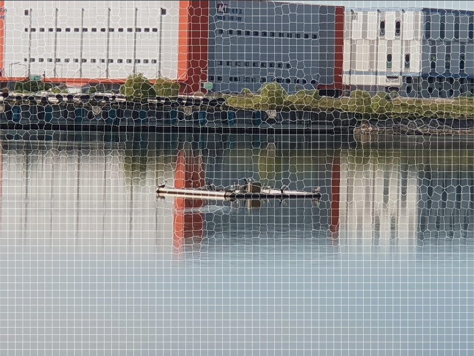

.. _segmentCanvasGeneration:

세그먼트 캔버스 생성
==============================

본 어노테이션 도구의 '세그먼트 어노테이션 편집'을 수행하기 위해선 각 이미지의 세그먼트 캔버스가 필요합니다.

어노테이션 도구 버전 |version| 에선 세그먼트 캔버스 생성 기능이 합쳐져 있지 않기에 별도로 제공된 파이썬 프로젝트를 이용합니다.

세그먼트 캔버스란?
---------------------

세그먼트 캔버스는 세그먼테이션 정보와 세그먼트 어노테이션 정보가 모두 담겨진 벡터 이미지 형식의 파일입니다.

    세그먼트 캔버스 예시

세그먼트 캔버스 생성 시 세그먼테이션 알고리즘으로부터 추출된 세그먼테이션 데이터를 기반으로 세그먼트 집합으로 구성된 벡터 격자를 형성합니다.

세그먼트는 유사한 성질을 가진 픽셀들의 집합으로 슈퍼 픽셀이라고도 불립니다. 이 유사성은 세그먼테이션 알고리즘에 따라 정의됩니다.

해당 이미지의 마스크 이미지가 존재한다면 이 값을 세그먼트 캔버스의 각 세그먼트에 적용시킬 수 있습니다.

저장된 세그먼트의 정보는 어노테이션 도구에서의 세그먼트 어노테이션 실행 시 바로 불러와 사용할 수 있습니다.

세그먼트 어노테이션 작업은 프로젝트 저장 혹은 산출 시 세그먼트 캔버스 svg 파일로 저장되며, 해당 정보를 어셋 데이터 json에 저장합니다.

최종 결과물 산출 시 MOAD JSON 산출 옵션 중 '세그먼트 어노테이션 이미지 (PNG) 포함'이 활성화되어 있는 경우 세그먼트 캔버스가 PNG 파일로 변환되어 산출됩니다.

환경 갖추기
---------------------

파이썬 프로젝트 내의 'images' 폴더에 원본 이미지들을 모두 위치시킵니다.

원본 이미지에 해당하는 마스크 이미지들이 있다면 'mask' 폴더에 위치시킵니다.

이 때 해당 마스크 이미지들의 이름은 '<원본 이미지 이름>_mask.png' 형식을 따라야 합니다.

실행 (svg 파일 산출)
---------------------------
프로젝트 내 'exportSegmentation.py'를 실행시킵니다.

해당 파일은 다음의 커멘드를 실행합니다::

    convertImageToSVG('./images', 1024, 768)

svg 파일들은 프로젝트 내 'svg' 폴더에 생성됩니다.

해당 svg 파일들은 프로젝트 생성 혹은 불러오기 시, 메타데이터 연결 폴더 내에 위치해야 합니다.

주의 사항
--------------

본 파이썬 프로젝트에서 생성되는 svg 파일의 어노테이션 값과 색은 어노테이션 도구의 어노테이션 값과 색과의 일치성이 보장되지 않습니다.

어노테이션 도구 버전 |version| 에서 수용 가능한 마스크 이미지는 COCO dataset의 값과 색을 사용한다는 가정을 가지고 있습니다. ('coco-color-tag.json' 참조)

세그먼트 캔버스 생성 시 COCO의 어노테이션을 MOAD 프로젝트의 컨텍스트에 맞춰 변화시켜줄 매핑이 필요하며, 이 매핑 정보는 프로젝트 내의 'coco-moad.json' 의 내용을 참조합니다.

.. code-block:: json
    :caption: coco-moad.json 예제
    
    {
        "mapping": {
            "sea": "바다",
            "water-other": "바다",
            "mountain-merged": "섬"
        },
        "categories": [
            {
            "name": "바다",
            "color": "#494DAE"
            },
            {
            "name": "섬",
            "color": "#40AA40"
            }
        ]
    }

따라서 COCO 어노테이션을 추가적으로 MOAD의 어노테이션으로 매핑하거나 해당 어노테이션의 색을 지정하는 등의 작업을 통해 상기의 일치성 문제를 해결해야 합니다.

보다 자세한 내용은 하기의 내용을 참조해주세요.

내부 실행 순서
--------------

1. 세그멘테이션 알고리즘 수행 및 세그먼테이션 데이터 저장

    - 원본 이미지에 SLIC 세그먼테이션 알고리즘 수행
    - 해당 결과 값을 'segmentationData' 폴더 내 세그멘테이션 데이터 (.seg) 파일로 저장

2. 마스크 이미지로부터 어노테이션 데이터 추출

    - 마스크 이미지 및 세그멘테이션 데이터를 이용하여 각 세그먼트의 COCO dataset 어노테이션 값을 추출
    - 해당 결과 값을 'annotatedData' 폴더 내 json 파일로 저장

3. COCO에서 MOAD로의 어노테이션 컨텍스트 변환

    - 어노테이션 데이터 및 'coco-moad.json' 파일을 이용하여 어노테이션 컨텍스트 변환
    - 해당 결과 값을 'annotatedData' 폴더 내 json 파일에 반영

4. 상기 산출물을 조합하여 세그먼트 캔버스 SVG 생성

    - 세그멘테이션 데이터와 어노테이션 데이터를 조합하여 SVG 파일 생성
    - 해당 결과 값을 'svg' 폴더 내 세그먼트 캔버스 (.svg) 파일로 저장

상기 단계 중 2단계에서의 대표 어노테이션 값은 마스크 이미지에서의 각 세그먼트 영역 내 최대 픽셀 출현 색(RGB)을 기반으로 정합니다.

해당 색에 대한 어노테이션 값은 프로젝트 내의 'coco-color-tag.json' 값을 통해 추출되며 마찬가지로 각 세그먼트의 어노테이션 값으로 저장됩니다.

